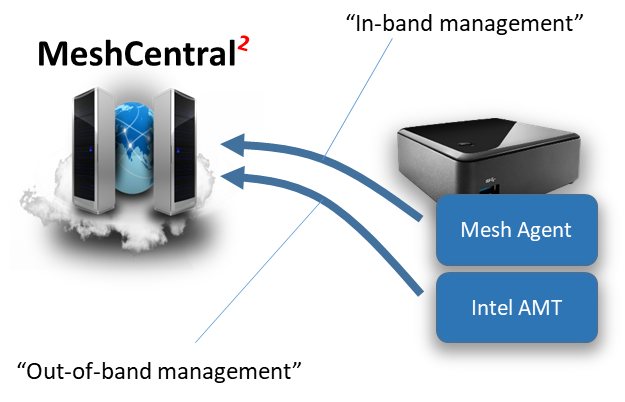
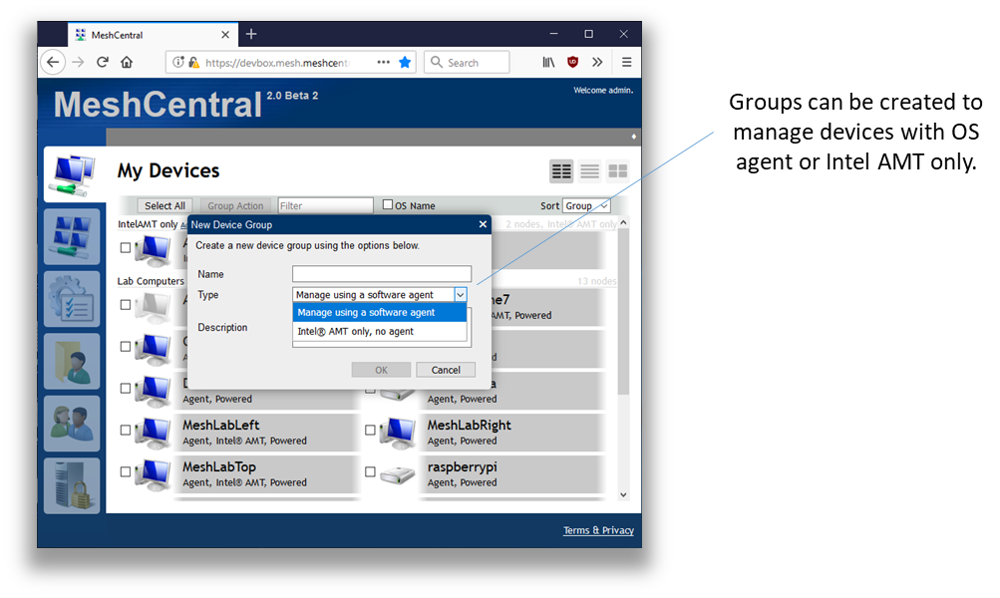
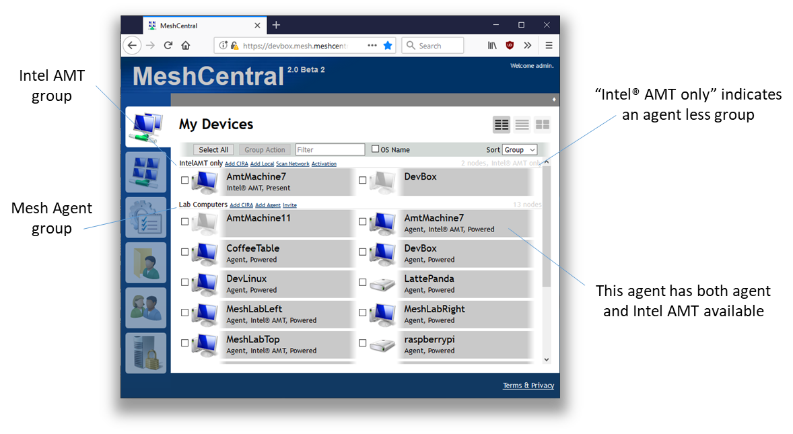
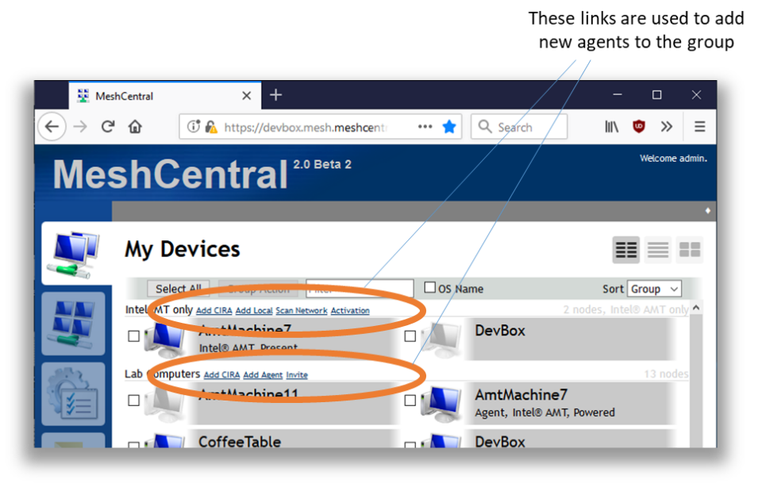
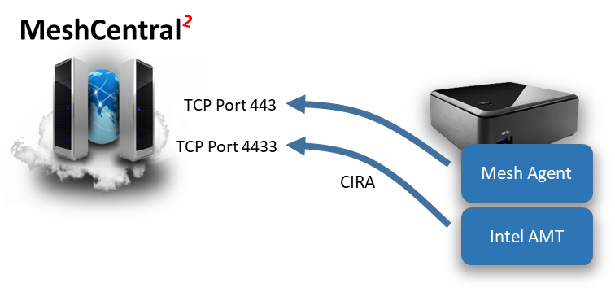
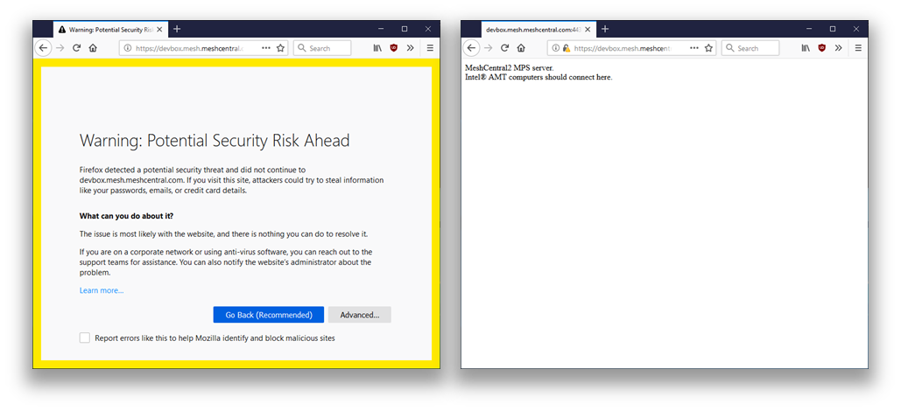
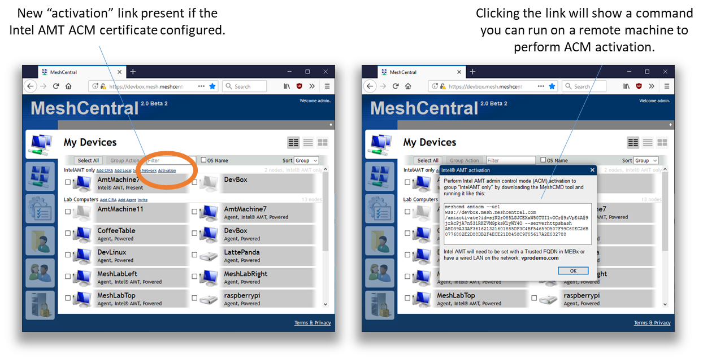
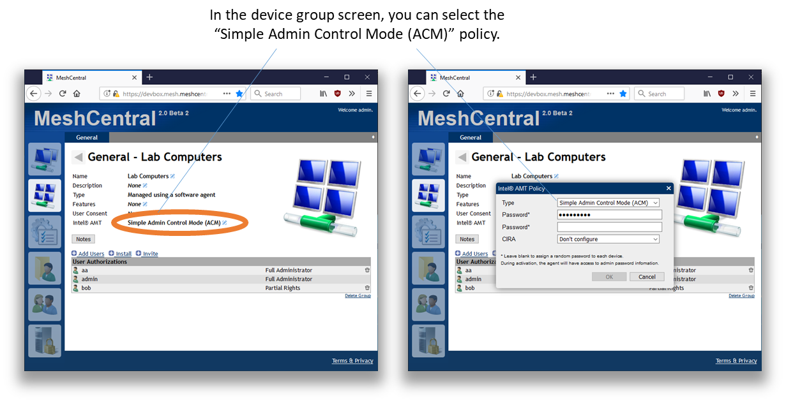
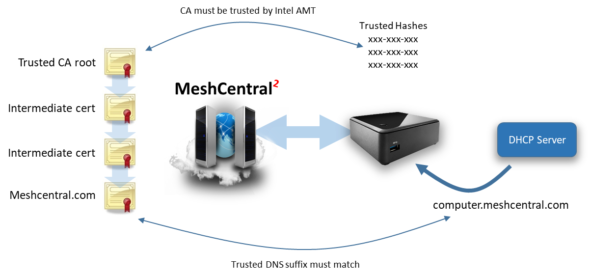

# Intel AMT


Intel AMT Guide [as .odt](https://github.com/Ylianst/MeshCentral/blob/master/docs/MeshCentral Intel AMT Guide v0.0.1.odt?raw=true)

## Video Walkthru

<div class="video-wrapper">
  <iframe width="320" height="180" src="https://www.youtube.com/embed/naWKE3rT6e8" frameborder="0" allowfullscreen></iframe>
</div>

## Abstract

This user guide contains all essential information for activating and using Intel® Active Management Technology (Intel® AMT) with MeshCentral. We will review how to activate, connect to and use Intel AMT features and how this benefit administrators that want to manage computers remotely. This document expect the reader to already be familiar with how to install and operate MeshCentral and have a basic understanding of how Intel® AMT works.

## Introduction

MeshCentral is a free open source web-based remote computer management software and it fully supports Intel® Active Management Technology (Intel® AMT). MeshCentral does not require that computers it manages support Intel AMT, but if a remote computer has this capability, MeshCentral will make use of it.

Intel AMT can be seen as a hardware based management agent that is built into some Intel PC’s. Once setup, Intel AMT can be used to remotely manage a computer regardless of the operating system health. It can be used to power on a computer when it’s in soft-off state or to provide enhanced monitoring and security to remote systems.

Once setup, a computer can have up to management connections to MeshCentral. One of them by the Mesh Agent that lives in the operating system and another connection from Intel AMT. When remote management is made using an operating system agent, we call this “in-band management” and when management is done using a hardware based agent like Intel AMT, we call this “out-of-band management”



MeshCentral can support computers that have either or both agents. So, you can setup a computer with just the Mesh Agent, just Intel AMT or both. In this document we will show how to install computers with both agent connections or with just Intel AMT. When Intel AMT is used alone, we call this “agent-less” as there will be no operating system software required to remotely manage the computer.

The Mesh Agent and Intel® AMT have very different and complementary capabilities and so, it’s often beneficial to use both and one will offer features the other can’t provide. Here are some of the benefits each has to offer:

Mesh Agent

  - Fast remote desktop / clipboard access.
  - Remote access to operating system files.
  - Remote chat and other OS features.

Intel® AMT

  - Remote desktop even when the agent or operating system is not functional.
  - Remote access to BIOS.
  - Connectivity when soft-off / sleeping.
  - Remote power actions.

If you are looking into managing remote computers that would be difficult to physically get access to for remote support or maintenance, one should probably look at getting a PC with Intel AMT.

## MeshCentral Group Types

Once MeshCentral is installed, a user will typically create a new device group. Here is the first hint that MeshCentral supports Intel AMT. Device groups come in two types. You can manage using a software agent, or using Intel AMT only.



Note that if you use the OS agent to manage computers, you can also set and use Intel AMT. However, if you opt to create an Intel AMT only group, then Mesh Agents are not supported. One can create groups of both types in order to manage devices that have and don’t have the Mesh Agent installed.



The main benefit of “Intel AMT only” group is if someone does not want to install a background agent on remote systems or already have a remote management solution and intends to only use MeshCentral to supplement the existing solution with Intel AMT features.

Once a group is created, the links MeshCentral provides to on-board devices will change depending on the group type and how the server is setup. The device on-boarding links are located in the “My Devices” page, next to the group name.



If the MeshCentral server is setup in “LAN mode” or “Hybrid mode”, options will be available to add computers on the local network. If you have an Intel AMT computer that is already activated, you can select the “Add Local” or “Scan Network” options in the “Intel AMT only” group type and start adding local network computers this way. If MeshCentral is in “WAN mode”, you will need to setup Intel AMT to connect back to MeshCentral using a feature called “Client Initiated Remote Access” or CIRA for short. We will cover that in a later section.

## Client Initiated Remote Access & MPS server

Client Initiated Remote Access (CIRA) is a feature of Intel AMT that, then configured, makes Intel AMT connect back to the server using a TLS tunneling connection similar with a SSH tunnel. Once this tunnel connection is established, the server can perform remote management operations on Intel AMT.

CIRA is great when remotely managing Intel AMT devices over the Internet thru network address translator (NAT) routers where the server would not be able to connect to Intel AMT. This is similar to the Mesh Agent that initiated and keeps an idle connection to the server.

By default, MeshCentral will be configured to receive Mesh Agent connections on TCP port 443 and Intel AMT connections on TCP port 4433. These port values can be configured in the config.json file of MeshCentral.



Once connected to port 443, the Mesh agent will using secure HTTPS WebSocket to securely communicate with the server. Intel AMT will use TLS to connect to port 4433 and use a binary tunneling protocol called the Intel AMT Port Forwarding Protocol (APF). You can find documentation on this protocol at the following URL: 

<https://software.intel.com/sites/manageability/AMT_Implementation_and_Reference_Guide/HTMLDocuments/MPSDocuments/Intel%20AMT%20Port%20Forwarding%20Protocol%20Reference%20Manual.pdf>

It’s not necessary to know or understand the details of this protocol, MeshCentral will take care of handling this. In Intel AMT nomenclature, the server that receives a CIRA connection is called a “Management Presence Server” or MPS for short. In other words, MeshCentral has a MPS server on port 4433 ready to receive Intel AMT CIRA connections.


When MeshCentral is first setup, a self-signed root certificate is created along with a MPS certificate that will be presented when a device connects on port 4433. There is typically no need to use a CA signed & trusted certificate on port 4433 was we only expect Intel AMT computers to connect to this port and we will be loading our self-signed root in Intel AMT for authentication purposes.

One way to check that the MeshCentral MPS server is running correctly is to use a browser and access port 4433 using HTTPS. The browser will display a warning because the port 4433 certificate is not trusted, but this is expected.



The CIRA protocol is binary, but MeshCentral will detect that the request is made from a browser and return a short message:

```
MeshCentral2 MPS server.
Intel® AMT computers should connect here.
```

This is practical to make sure connectivity with the MeshCentral MPS server is working. Now that we know the basics of Intel AMT CIRA and the MPS server, we can configure Intel AMT to connect.

## Activation Certificate Setup

If you have an Intel AMT activation certificate, you should configure MeshCentral to take advantage of it. Your activation certificate must have been issued by one of the certificate authorities (CA’s) that is trusted by Intel AMT and MeshCentral will need the entire certificate chain to be provided since the entire chain is needed to perform Intel AMT ACM activation.


The leaf certificate will have the Intel AMT activation option and a specific domain name while the hash of the trusted CA certificate must be trusted by Intel AMT. The certificate chain will have to be setup in the domain section of the MeshCentral config.json file.

If you have a certificate chain in a .pfx or .p12 format, place that file in the “meshcentral-data” folder and add the “AmtAcmActivation” section in the domain section like so:

```
{
  "settings": {
    "Cert": "devbox.mesh.meshcentral.com",
  },
  "domains": {
    "": {
      "title": "My Server",
      "AmtAcmActivation": {
        "log": "amtactivation.log",
        "certs": {
          "myamtcert": {
            "certpfx": "amtcert.pfx",
            "certpfxpass": "pfxpassword"
          }
        }
      }
    }
}
```

If you have the certificate chain in PEM format as a set of .crt files and a .key file, start by placing all of the certificate files in the “meshcentral-data” folder and setup the certificate chain like this:

```
{
  "settings": {
    "Cert": "devbox.mesh.meshcentral.com",
  },
  "domains": {
    "": {
      "title": "My Server",
      "AmtAcmActivation": {
        "log": "amtactivation.log",
        "certs": {
          "myvprocert": {
            "certfiles": [ "amtacm-vprodemo.crt",
   "amtacm-intermediate1.crt",
   "amtacm-intermediate2.crt",
   "amtacm-root.crt" ],
            "keyfile": "amtacm-vprodemo.key"
          }
        }
      }
    }
}
```

It’s important that the leaf certificate file be the first file in the “certfiles” array. The order of the other certificates is not important as MeshCentral will figure out and re-order them correctly. 

Within the new “AmtAcmActivation” section, there is a “log” entry. This is a log file that will contain every activation attempt including the details of the computer being activation and what Intel AMT administrator password was used for activation. This log file should be kept securely as it will contain Intel AMT credentials. It’s also important to have this file as a backup so that Intel AMT credentials are not lost after activation. If MeshCentral can’t write to this log, the activation will not go forward and will fail.

Once the config.json was modified, restart the server. There will be two indications that the server has the new certificate correctly configured. For “Intel AMT only” groups, a new “Activation” link will show up. Clicking this link will show a command that can be run to perform ACM activation.



For device groups that operate with a Mesh Agent, you can edit the group and select the “Simple Admin Control Mode” Intel AMT activation policy. This policy is not available unless a correct Intel AMT ACM activation certificate is configured.



Once setup, Intel AMT will not automatically activate to Intel AMT unless the right situation is met. The Intel AMT activation certificate is for a specific domain name suffix, for example “meshcentral.com”. Intel AMT must be in a situation where this domain can be accepted. One of the following must be true:

  - Intel AMT must have a wired Ethernet interface that is connected to a local network with a DHCP server responding with option 15 set to “xxx.meshcentral.com”.
  - The name “meshcentral.com” by have been set as “Trusted FQDN” in MEBx.
  - The name “meshcentral.com” must have been set using a USB key with a setup.bin file.

Once Intel AMT is in a situation where ACM activation can occur, the activation command line can be run or the Mesh Agent will detect this situation and ask the server to perform activation.



The best way to test this feature is to create an “Intel AMT only” device group and run the MeshCMD command on the remote system to perform activation. If there is a problem, this process should clearly display why ACM activation fails.
