# MeshCmd

MeshCmd Guide [as .pdf](https://meshcentral.com/info/docs/MeshCmdUserGuide.pdf) [as .odt](https://github.com/Ylianst/MeshCentral/blob/master/docs/MeshCmd User's Guide v0.0.3.odt?raw=true)

## Video Walkthru

<div class="video-wrapper">
  <iframe width="320" height="180" src="https://www.youtube.com/embed/AzdKyzqmpIs" frameborder="0" allowfullscreen></iframe>
</div>

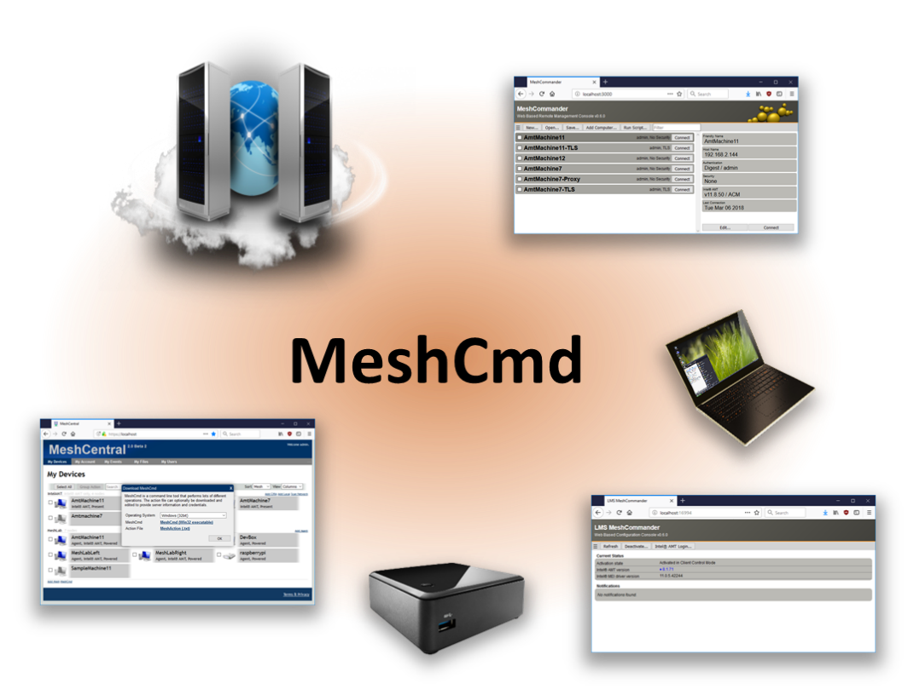

## Abstract

This user guide contains all essential information for the user to make full use of MeshCmd, a command line tool used to perform tasks on MeshCentral and for Intel® AMT. This tool run on Windows and Linux and perform a wide array of different tasks. From routing traffic over the Internet to activating Intel AMT, MeshCmd is a great do it all tool for computer management. 

## Introduction

MeshCmd, called “Mesh Command”, is a command line tool that runs on both Windows and Linux and used to perform many tasks related to computer management. As the tool continues to evolve, it will continue to be improved and acquire more features. Broadly, the tool is intended to perform three sets of tasks. 

`MeshCentral2 command line operations`
- There are command line operations that relate to interacting with the MeshCentral2 server. A good example of this is to route traffic from your computer to a remote computer on the internet thru a MeshCentral2 server. 
  
`Intel AMT local actions`
- If you happen to have Intel AMT on your computer, MeshCmd can take a look at the version and activation status, activate and de-activate Intel AMT and help with getting access to Intel AMT and more. 

`Intel AMT remote actions`
- Whether you have Intel AMT on your local computer or a remote computer on your network, MeshCmd can help unlock the features Intel AMT provides. From getting the state of Intel AMT remotely to running configuration scripts and loading MeshCommander into Intel AMT web storage. 

To get started, you need to download MeshCmd for your computer. MeshCmd is a single file executable that you can get on MeshCommander.com at: [http://www.meshcommander.com/meshcommander/meshcmd](http://www.meshcommander.com/meshcommander/meshcmd)  


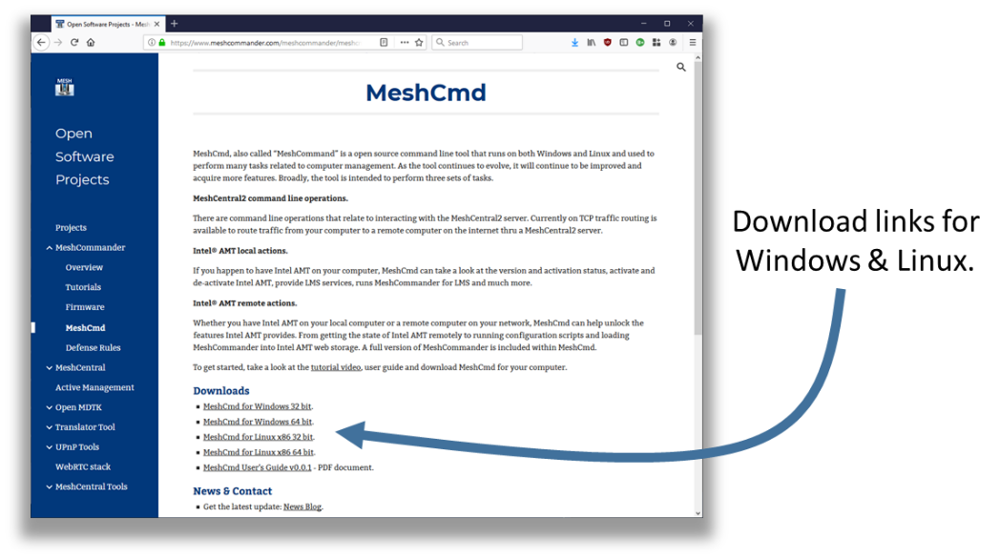
If you have access to a MeshCentral2 server, the download link to MeshCmd is at the bottom left of the main device page. 

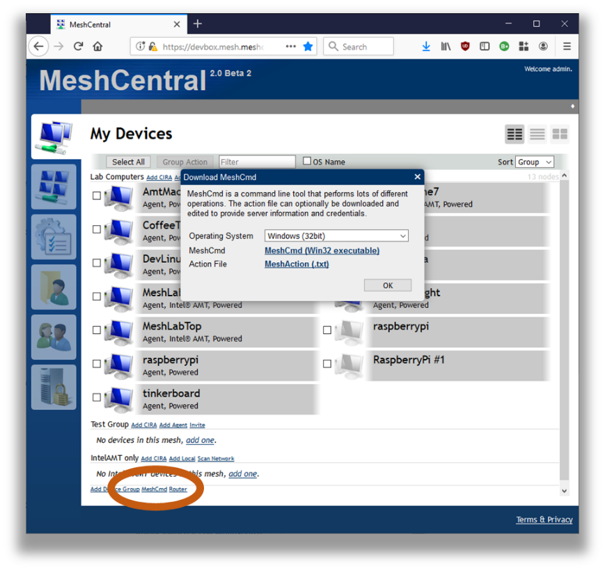

Once you click on the “MeshCmd” link, a dialog box will allow you to select the operating system you want to get a link to MeshCmd. MeshCentral will also provide an action file called meshaction.txt that contains information on how MeshCmd can connect back to that MeshCentral server. This is optional, and only used for some operations. 

Once downloaded, just run it from the command prompt or terminal window. 

```
C:\Temp>meshcmd
MeshCentral Command (MeshCmd)
No action specified, use MeshCmd like this:

  meshcmd [action] [arguments...]

Valid MeshCentral actions:
  Route             - Map a local TCP port to a remote computer.

Valid local actions:
  SMBios            - Display System Management BIOS tables for this computer.
  RawSMBios         - Display RAW System Management BIOS tables for this computer.
  MicroLMS          - Run MicroLMS, allowing local access to Intel AMT.
  AmtInfo           - Show Intel AMT version and activation state.
  AmtVersions       - Show all Intel ME version information.
  AmtHashes         - Show all Intel AMT trusted activation hashes.
  AmtCCM            - Activate Intel AMT into Client Control Mode.
  AmtACM            - Activate Intel AMT into Admin Control Mode.
  AmtDeactivate     - Deactivate Intel AMT if activated in Client Control mode.
  AmtAcmDeactivate  - Deactivate Intel AMT if activated in Admin Control mode.

Valid local or remote actions:
  MeshCommander     - Launch a local MeshCommander web server.
  AmtUUID           - Show Intel AMT unique identifier.
  AmtAuditLog       - Show the Intel AMT audit log.
  AmtLoadWebApp     - Load MeshCommander in Intel AMT 11.6+ firmware.
  AmtClearWebApp    - Clear everything from Intel AMT web storage.
  AmtStorageState   - Show contents of the Intel AMT web storage.
  AmtSaveState      - Save all Intel AMT WSMAN object to file.
  AmtPresence       - Heartbeat a local Intel AMT watchdog agent.
  AmtScript         - Run .mescript on Intel AMT.
  AmtIDER           - Mount local disk image to remote computer.

Help on a specific action using:

  meshcmd help [action]
```

By default you will get the help screen with all of the different actions you can take with the tool. You can also get help by typing “help” followed by the action name. In this document we will cover the main actions that MeshCmd can perform. If you don’t use Intel AMT at all, then only the MeshCentral actions are interesting for you. If you use Intel AMT, the rest of the actions will be of interest to you. 

## MeshCentral TCP port mapping

MeshCmd can map a TCP port from your local computer to any remote port on any computer with one of your MeshAgents installed. This port mapping will work over a local network or the Internet and should work even thru proxies and firewalls. 

In order to start using MeshCmd in this way, you first need to have access to a MeshCentral server and at least one computer you already manage. TCP port mapping works by selecting a port on your local computer that will be routed to a remote device and port. Here, local port 123 is routed thru the server to port 123 on a remote device. 

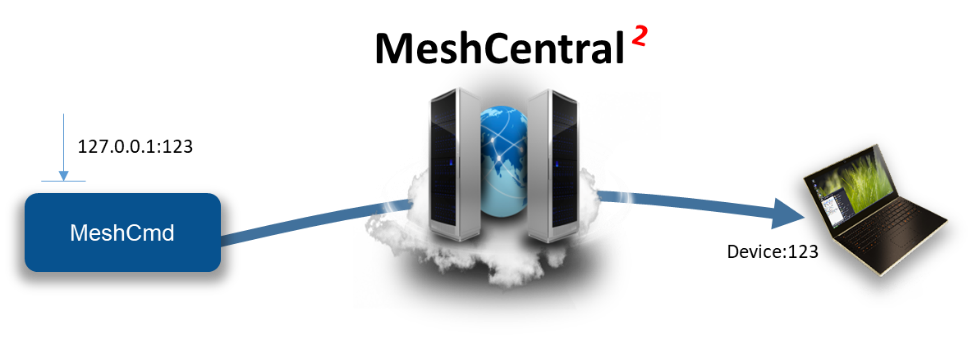

Of course, this picture is a bit simplify. Firewalls, NAT routers and HTTP proxies may be in the way and the MeshAgent on the remote computer will act at the TCP traffic relay in most cases. 

One typical use of this is to route local port 1234 to port Microsoft RDP port 3389 on a remote device. Once routed, you can start a RDP session on “localhost:1234” and get a RDP session to the remote device. The RDP protocol is feature rich and efficient, so you get a great user experience regardless of where in the world the remote computer is at. 

To get started, click on a device in MeshCentral and click on the “Router” link on the bottom left of the device page.  

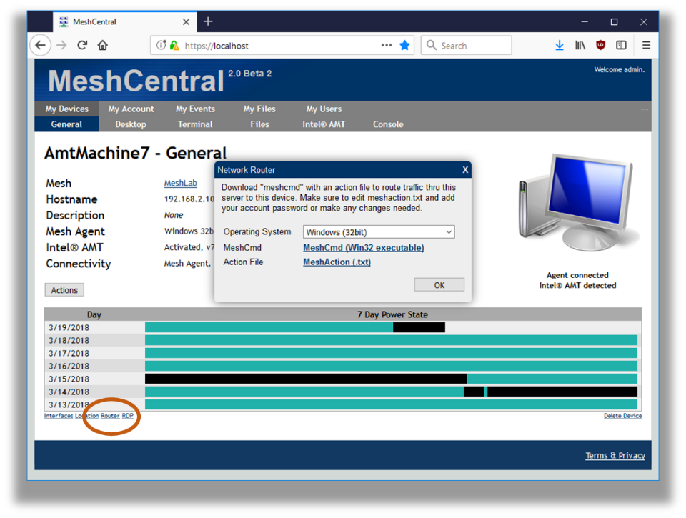

You can download MeshCmd is you have not done so already, but more importantly, download the action.txt file. The file is in text format and contain something like this: 

```
{
 "action": "route",
 "localPort": 1234,				 Change this
 "remoteName": "AmtMachine7",
 "remoteNodeId": "node//@yw$s5jLUivpzZ49laprt4T0sBaOKImbDAiniothQwccZPukCB696$BvPWAW0Bg2",
 "remotePort": 3389,				 Change this
 "username": "admin",
 "password": "",				 Note that the password is empty
 "serverId": "D99362D5ED8BAEA8BF9E743B34B242256370C460FD66CB62373C6CFCB204D6D70
7403E396CF0EF6DC2B3A42F735135FD",
 "serverHttpsHash": "D9DE9E27A229B5355708A3672FB23237CC994A680B3570D242A91E36B4AE5BC
96539E59746E2B71EEF3DBDABBF2AE138",
 "debugLevel": 0,
 "serverUrl": "wss://devbox.mesh.meshcentral.com:443/meshrelay.ashx"
}
```

The action file contains almost all the parameters needed to perform the route. It indicates the local and remote ports, the remote computer unique identifier, server location and authentication information and more. You can just put the action file in the same folder as MeshCmd and run MeshCmd, it will automatically pick up the arguments from the meshaction.txt file. 

You may want to change the local and remote port in the action file to suite your needs. Be default, the Microsoft RDP port is the target. If the password is not specified in the meshaction.txt file, you can also specify it as a meshcmd argument. 

```
C:\MeshCmd>meshcmd --pass xxxxxxxx 
Redirecting local port 1234 to AmtMachine7:3389. Press ctrl-c to exit. 
Now, the traffic router is ready. You can now RDP to localhost:1234 and login to the remote computer. 
```

## MeshCommander

MeshCommander is a web based Intel AMT management console. MeshCmd has no less then three different versions of MeshCommander built-in, so if you are using Intel AMT, it’s worth a moment to get some knowledge about MeshCommander which is available as a standalone tool along with a full user’s guide at:[http://www.meshcommander.com/](http://www.meshcommander.com/)and also included as part of MeshCentral. 

The three versions included in MeshCmd are: 

- MeshCommander as a local web server. 
- MeshCommander for LMS 
- MeshCommander for firmware. 

In this section, we review the three versions, how they are used and what can be done with them. 

### MeshCommander local web server

You can start MeshCommander on a local web server by typing “meshcmd meshcommander”. By default, local port 3000 is used, but you can optionally specify the port using “--localport [port]”. Running it with look like this: 

```
C:\MeshCmd>meshcmd meshcommander
MeshCommander running on HTTP port 3000. Ctrl-C to exit. 
```

Once running, use a web browser and go to “http://localhost:3000” to see the MeshCommander web page. The page will start out without any computers in it and you will have to add some. 

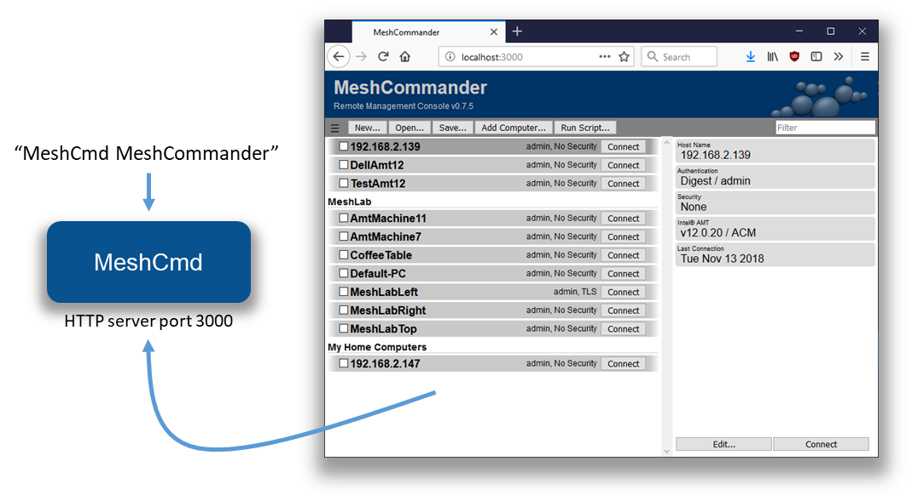

In this mode, the local computers that are added will be stored in the browser’s storage cache. So, clearing the browser’s cache will also clear the list of computers. You can however load and save the list of computers using the “Open…” and “Save…” buttons. This version of MeshCommander will have some limitations when compared to the full version installed using the Windows .MSI installer. Notably: 

- No certificate management or validation. 
- Mutual-Authenticated TLS is not supported. 
- Kerberos authentication is not supported. 
- IDE-R is not supported. 

This said, features like KVM, Terminal and most Intel AMT configuration options are available which makes this a fairly powerful Intel AMT management console. You can run MeshCommander as a background server on both Windows and Linux. To do this, use the install, uninstall, start and stop commands like this: 

```
C:\MeshCmd>meshcmd meshcommander install
Installing to "C:\Program Files (x86)\Open Source\MeshCmd\MeshCommander.exe" MeshCommander installed. 

C:\MeshCmd>meshcmd meshcommander start
MeshCommander starting.
```

On Linux computers, both systemd and initd are supported. When installing, the MeshCmd executable will be copied to a different installation folder. 

### LMS & MeshCommander

The Layered Management Service (LMS) is a background process that runs in the operating system and provides local OS access to Intel AMT. More specifically, it redirects local TCP ports 16992 and 16993 to Intel AMT thru the MEI driver. One way to check if the LMS service is installed on your computer is to try[http://localhost:16992](http://localhost:16992/) or [https://localhost:16993](https://localhost:16993/)in a browser. A page should generally show up. 

On Windows, LMS is a Windows service that must be downloaded and installed as part of the OEM drivers for a computer. On Linux, it’s generally never installed and users normally have to download the source code and compile it themselves. 

MeshCmd has its own LMS implementation, so is LMS is not installed it will automatically use its own internal one. In addition, you can run MicroLMS alone by typing the following list while running as root or local administrator: 

```
C:\MeshCmd>meshcmd microlms
MicroLMS started, MeshCommander on HTTP/16994. 
```

This will start MicroLMS and as indicated, start MeshCommander on local port 16994 at the same time. In total, traffic redirection looks like this: 

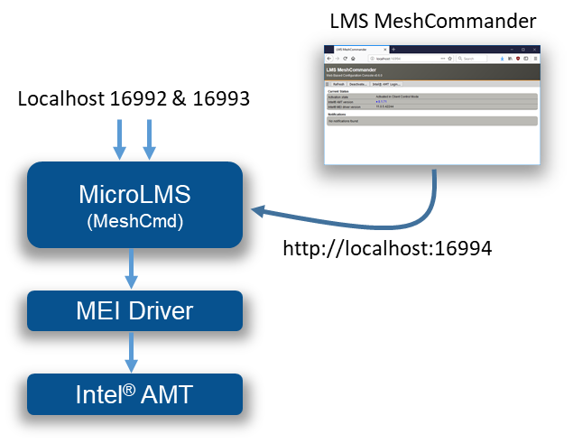

In addition to providing normal services, MicroLMS that is part of MeshCmd will also start a web server on port 16994 and allow a browser to access LMS MeshCommander, a special version of MeshCommander specially made to run in this situation. 

MeshCommander for LMS will show up even if the computer has Intel AMT un-configured and offer the user the choice to activate Intel AMT and perform configuration actions. In the following screen, we see a computer activated in Client Control Mode. Because it’s in this mode, you can use the web interface to de-activate Intel AMT or login to perform additional configuration. 

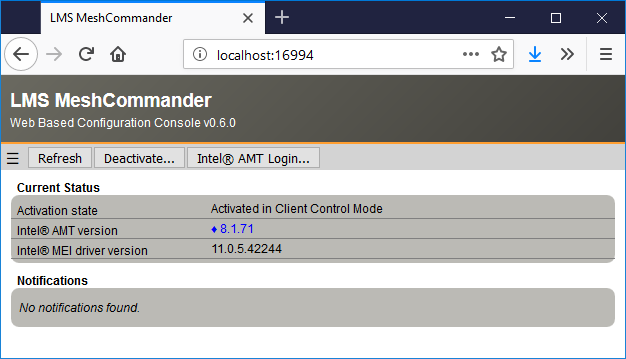

MicroLMS along with MeshCommander for LMS is very useful, especially on Linux as it offers a single tool to setup and configuration Intel AMT. If you wish you run MicroLMS without MeshCommander being available on port 16994, run MeshCmd with “--noconsole": 

```
C:\MeshCmd>meshcmd microlms --noconsole
MicroLMS started. 
```

You can run MicroLMS as a background server on both Windows and Linux. To do this, use the MicroLMS install, uninstall, start and stop commands like this: 

```
C:\MeshCmd>meshcmd microlms install
Installing to "C:\Program Files (x86)\Open Source\MeshCmd\MicroLMS.exe" 
MicroLMS installed. 

C:\MeshCmd>meshcmd microlms start
MicroLMS starting. 
```

On Linux computers, both systemd and initd are supported. When installing, the MeshCmd executable will be copied to a different installation folder. 

### MeshCommander for firmware

MeshCmd also includes a surprising version of MeshCommander, the one you can load into the firmware of Intel AMT. Starting with Intel AMT 11.6, you can push into the small ~190k storage space of Intel AMT a replacement to the index.htm page served by the firmware on port 16992 & 16993. In the following picture, the left side is the original Intel AMT web page, the right is the replaced MeshCommander built to go in firmware. 

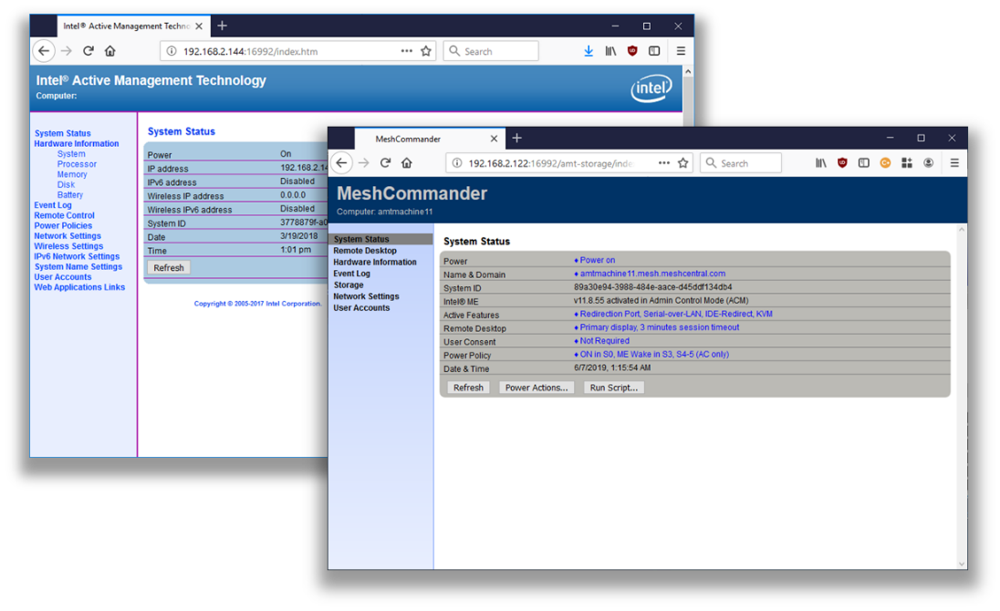

The firmware version of MeshCommander has support for remote desktop, terminal and all sorts of Intel AMT usages and configuration. Probably the most surprising is that this entire page is between 40k and 100k depending on the version you select. It’s notable that with MeshCommander loaded into Intel AMT firmware, one does not need any other tool except for a browser to perform most Intel AMT maintenance operations. 

```
C:\MeshCmd>meshcmd amtloadwebapp --host 192.168.2.144 --pass xxxxxxxx
Uploading MeshCommander...
Verifying MeshCommander...
Done.
```

To get the current state of Intel AMT web storage, type this: 

```
C:\MeshCmd>meshcmd amtstoragestate --host 192.168.2.144 --pass xxxxxxxx
Storage State: {
  "information": {
    "version": 1,
    "realms": 7765759,
    "user": "admin"
  },
  "content": {
    "index.htm": {
      "size": 57246		 Replacement index.htm with size.
    }
  }
}
```

Here, a 57k index.htm replacement is present in the Intel AMT flash. You can clear the web storage, revering the web page back to the original like this: 

```
C:\MeshCmd>meshcmd amtclearwebapp --host 192.168.2.144 --pass xxxxxxxx
Done.
```

When MeshCommander is loaded into Intel AMT, you can access it from a different computer using [http://computername:16992 ](http://computername:16992/)or[https://computername:16993](https://computername:16993/) You will need to authenticate first before getting access to the web page. 

## Intel AMT state & activation

MeshCmd can easily be used to read the local state of the computer and Intel AMT. There are many commands available to do this. The “SMBios” action works on most computers and is used to get basic information about your current system. The output is JSON format. 

```json
C:\MeshCmd>meshcmd smbios
{
  processorInfo: {
    0: {
      Processor: "CPU"
      MaxSpeed: "3800 Mhz"
      Cores: 4
      Threads: 8
      Populated: 1
      Status: "Enabled"
      Socket: "CPU 1"
      Manufacturer: "Intel(R) Corporation"
      Version: "Intel(R) Core(TM) i7-3770 CPU @ 3.40GHz"
    }
  }
  memoryInfo: {
    location: "System Board"
    maxCapacityKb: 33554432
  }
  systemInfo: {
    uuid: "C57B83D9A94E11E18BA1505054503030"
    wakeReason: "Power Switch"
  }
  systemSlots: {
    uuid: "C57B83D9A94E11E18BA1505054503030"
    wakeReason: "Power Switch"
  }
  amtInfo: {
    AMT: true
    enabled: true
    storageRedirection: true
    serialOverLan: true
    kvm: true
    TXT: false
    VMX: true
    MEBX: "66.0.0.8"
    ManagementEngine: "8.1.0.57353"
  }
}
```

If you have Intel AMT on your system, you can use the “amtinfo”, “amtversions” and “amthashes” to get lots of information about Intel AMT current state. These commands use the Intel AMT MEI driver to get this information and require MeshCmd be run as root or administrator: 

```
C:\MeshCmd>meshcmd amtinfo
Intel AMT v8.1.71, activated in client control mode.
Wired Enabled, DHCP, 00:1E:8C:F5:4F:ED, 192.168.2.10.

C:\MeshCmd>meshcmd amtversions
MEI Version = MKQ7710H.86A.0072.2017.0519.1347
Flash = 8.1.71
Netstack = 8.1.71
AMTApps = 8.1.71
AMT = 8.1.71
Sku = 24584
VendorID = 8086
Build Number = 3608
Recovery Version = 8.1.71
Recovery Build Num = 3608
Legacy Mode = False

C:\MeshCmd>meshcmd amthashes
VeriSign Class 3 Primary CA-G1, (Default, Active)
  SHA256: E7685634EFACF69ACE939A6B255B7B4FABEF42935B50A265ACB5CB6027E44E70
VeriSign Class 3 Primary CA-G3, (Default, Active)
  SHA256: EB04CF5EB1F39AFA762F2BB120F296CBA520C1B97DB1589565B81CB9A17B7244
…
```

In addition to getting Intel AMT state, MeshCmd can activate Intel AMT in client control mode (CCM) and de-activate Intel AMT if it’s in this mode. Doing this is very simple, starting with Intel AMT not being activated, you use the “amtccm” and “amtdeactivate” actions. 

```cmd
C:\MeshCmd>meshcmd amtinfo
Intel AMT v8.1.71, pre-provisioning state.

C:\MeshCmd>meshcmd amtccm --pass xxxxxxxx
Success

C:\MeshCmd>meshcmd amtinfo
Intel AMT v8.1.71, activated in client control mode.

C:\MeshCmd>meshcmd amtdeactivate
Success
```

Note that when using the “amtccm” action, you need to provide a password that will be used for authentication into Intel AMT. This password must be strong with at least 8 characters including a lower case, an uppercase, a numeric value and a non-alpha-numeric value. 

## Intel AMT Audit Log

One very useful feature of MeshCmd is its ability to fetch the Intel AMT audit log. This can be valuable when doing forensics on a computer or just trying figure out what is being done thru Intel AMT. MeshCmd can pull the audit log on a local computer without any credentials, as long as it’s running as root or administrator, or pull the audit log remotely if usual credentials are provided. 


The Intel AMT audit log will show when a computer’s Intel AMT was activated, when remote desktop sessions where initiated and more. To get the local audit log, just use the “AmtAuditLog” action. 

```cmd
C:\MeshCmd>meshcmd amtauditlog
2004-01-01 19:17:58.000-08:00 - Local: Provisioning Started
2018-01-26 14:03:16.000-08:00 - Local: Unprovisioning Started
2018-01-26 14:03:31.000-08:00 - Local: Provisioning Started
2018-02-01 12:13:14.000-08:00 - admin: KVM Enabled
2018-02-01 12:16:01.000-08:00 - admin: KVM Session Started
2018-02-01 12:16:07.000-08:00 - admin: KVM Session Ended
2018-02-02 10:56:06.000-08:00 - admin: KVM Session Started
2018-02-02 10:56:08.000-08:00 - admin: KVM Session Ended
```

To get a remote audit log: 

```cmd
C:\MeshCmd>meshcmd amtauditlog --host 192.168.2.144 --user admin --pass xxxxxxxx
2003-12-31 23:06:58.000-08:00 - $$OsAdmin: Intel(r) ME Time Set
2017-08-15 06:53:31.000-07:00 - $$OsAdmin: Intel(r) ME Time Set
2017-10-13 17:55:11.000-07:00 - Local: Provisioning Started
2017-10-13 17:55:54.000-07:00 - Local: Opt-In Policy Change
2017-10-15 06:44:38.000-07:00 - admin: KVM Enabled
```

You can also save the audit log to file using the “--output" option. 

## Running Intel AMT script

MeshCmd has a full WSMAN stack built-in and can be used to run “.mescript” file on a target Intel AMT computer. Script file are useful when you want to run a set of actions on one or more Intel AMT computers at once. You can build a .mescript file using the script editor within MeshCommander. 

This script editor allows the user to drag & drop script blocks, set parameters on each block and test the script against a connected Intel AMT computer. 

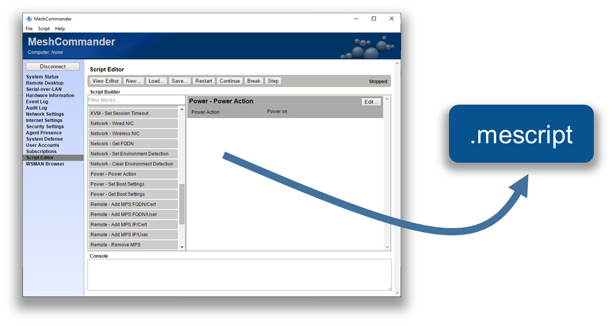

In addition to building your own scripts, you can download a CIRA setup script from a MeshCentral server. When running this script, Intel AMT will be setup to call back to the server using an encrypted connection. This enables remote management of Intel AMT over the Internet. The CIRA setup script is available in the “Add CIRA” link for meshes that are Intel AMT only (no agent). 

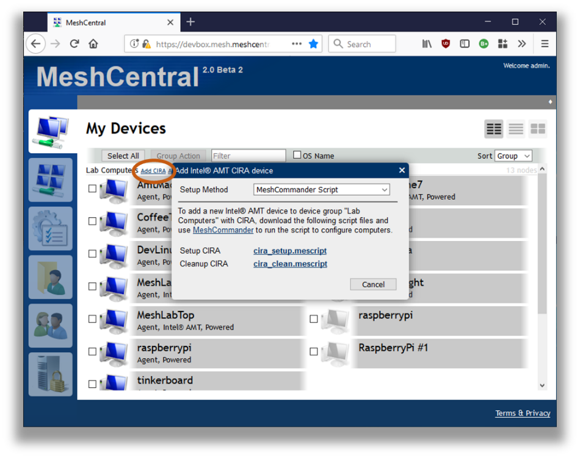

Once you got the script, run it with MeshCmd like this. You specify the host if it’s not localhost, the password and the script file. 

```cmd
C:\MeshCmd>meshcmd amtscript --host 192.168.2.106 --pass xxxxxxxx --script cira_setup.mescript
Script Started
Policies removed successfully
Adding root certificate...
Management Presence Server (MPS) successfully added
Found matching (primary) mps: Intel(r) AMT:Management Presence Server 0
Setting policy...
Policy added successfully
Remote Access user interfaces set to: BIOS & OS Enabed
Parsing block parameters
Setting Environment Detection
Environment Detection set successfully
Script Completed
```

In this example, the CIRA setup script was run on a remote computer. After the script is run, the computer got configured and connected back to the server. MeshCentral show the new connection state for this computer. 

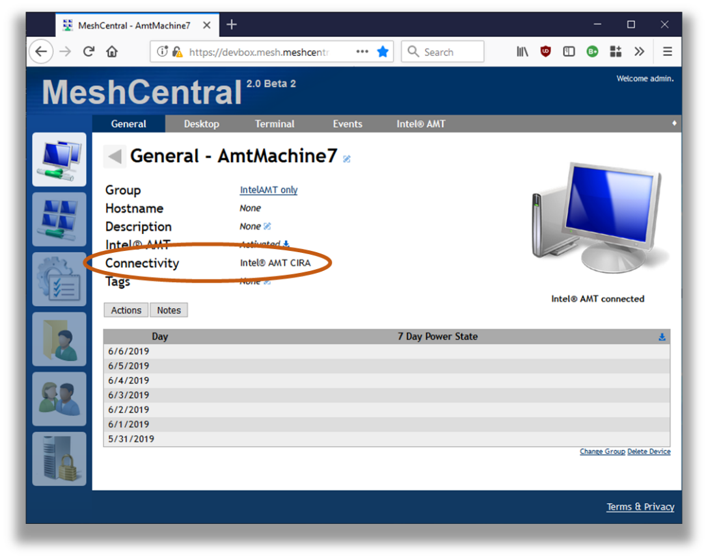

## IDE Redirection

MeshCmd has all the code needed to perform Intel AMT IDE Redirection from the command line. This allows disk images on the administrator’s computer to be remotely mounted to an Intel AMT computer. You need to start with a floppy disk .img file and/or an .iso CDROM file. 


Then use the “AmtIDER” command of MeshCMD to start an IDER session. The help command for AmtIDER looks like this: 

```cmd
C:\Temp>meshcmd help amtider
AmtIDER will mount a local disk images to a remote Intel AMT computer. Example usage:

  meshcmd amtider --host 1.2.3.4 --user admin --pass mypassword --tls --floppy disk.img --cdrom disk.iso

Possible arguments:

  --host [hostname]      The IP address or DNS name of Intel AMT.
  --user [username]      The Intel AMT login username, admin is default.
  --pass [password]      The Intel AMT login password.
  --tls                  Specifies that TLS must be used.
  --floppy [file]        Specifies .img file to be mounted as a flppy disk.
  --cdrom [file]         Specifies .img file to be mounted as a CDROM disk.
  --timeout [seconds]    Optional, disconnect after number of seconds without disk read.
```

  The command is fairly simple. It takes as input a remote host, username/password for Intel AMT login, the disk images and TLS option. One can also specify the timeout option so that MeshCMD will automatically disconnect when no disk read operations are performed for a set number of seconds. 

## Conclusion

MeshCmd is a cross-platform command line tools that perform an ever-growing list of actions that are important for remote computer management. MeshCmd works alone or with MeshCentral and MeshCommander to offer a suite of free, opens source and powerful tools that work well together. 

## License

MeshCmd and this document are both opens source and licensed using Apache 2.0, the full license can be found at [https://www.apache.org/licenses/LICENSE-2.0](https://www.apache.org/licenses/LICENSE-2.0) 
