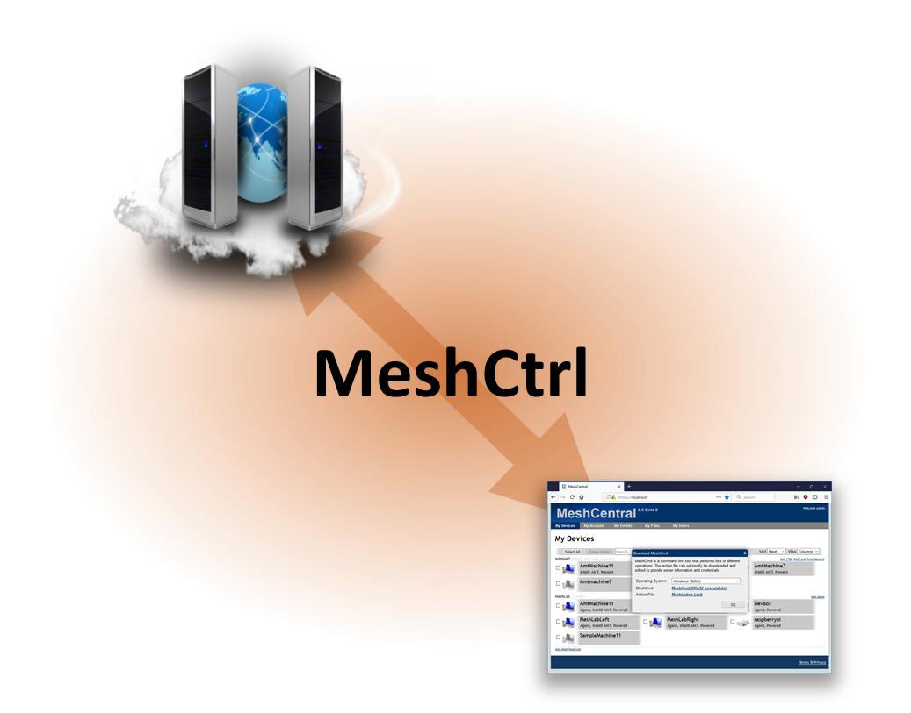
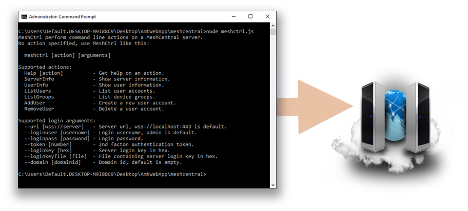
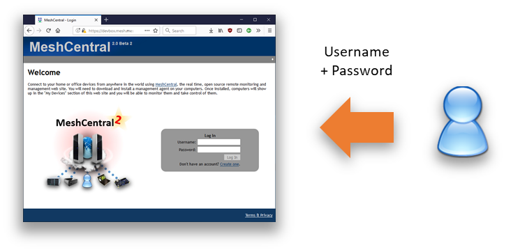
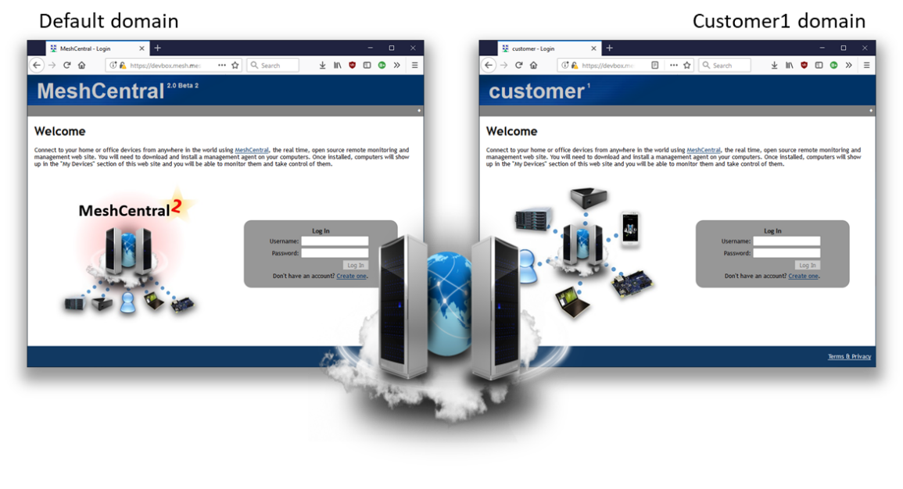
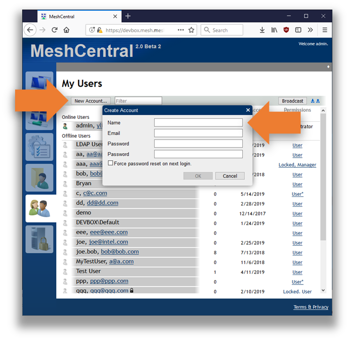
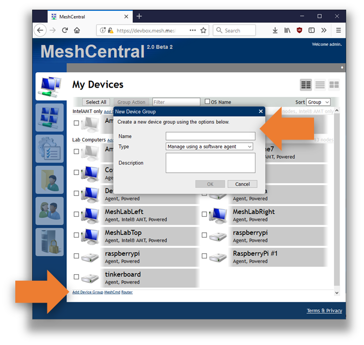
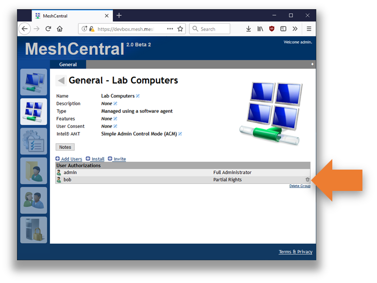
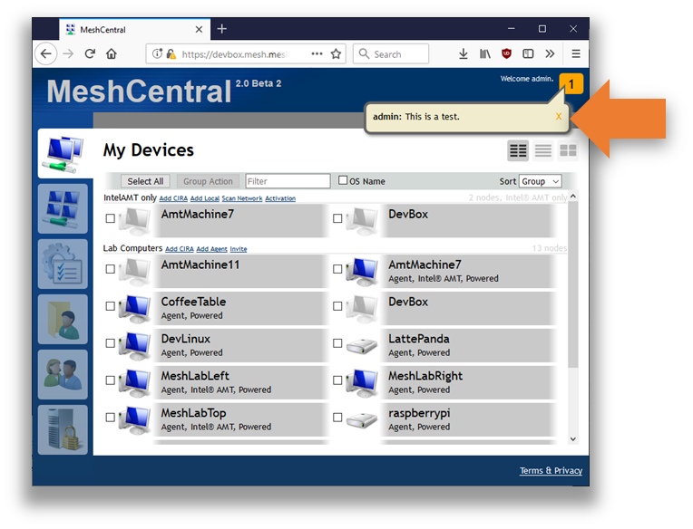

# MeshCtrl

MeshCmd Guide [as .pdf](https://meshcentral.com/info/docs/MeshCtrlUsersGuide.pdf) [as .odt](https://github.com/Ylianst/MeshCentral/blob/master/docs/MeshCtrl User's Guide v0.0.1.odt?raw=true)

## Video Walkthru

<div class="video-wrapper">
  <iframe width="320" height="180" src="https://www.youtube.com/embed/p_jdtYJyuBQ" frameborder="0" allowfullscreen></iframe>
</div>




## Abstract 

This user guide contains all essential information for the user to make full use of MeshCtrl, a command line tool used to perform tasks on the MeshCentral server. This tool is built in NodeJS and can be run on the same computer as the server, or on a different computer. It’s typically used by administrators to perform various management operations on the MeshCentral server. 

## Introduction 

MeshCtrl, also called “Mesh Control”, is a command line tool built in NodeJS that comes with MeshCentral and allows command line management operation of the MeshCentral server. It can be run both on the same computer as the MeshCentral server, or on a different computer. This tool allows an administrator to list user accounts, create and remove user accounts, list device groups and much more. All of the operations performed by this tool can also be performed using the MeshCentral website, however it’s sometimes useful to automate and script some management operations from the command line and this tool can do this. 



MeshCtrl will login to the MeshCentral server using a web socket connection, just like the web application does and so, it needs to login to the server using user or administrator credentials. In the next section, we will cover how to login using MeshCtrl, we then follow with the operations that MeshCtrl can perform. 

## Running MeshCtrl 

MeshCtrl.js is a file that is installed with MeshCentral and is located in the “./node\_modules/meshcentral” folder. You can normally run MeshCtrl like this: 

```
node ./node\_modules/meshcentral/meshctrl 
```

In this case, when the above command is run without parameters, you should see something like this: 

```
MeshCtrl performs command line actions on a MeshCentral server.
Information at: https://meshcommander.com/meshcentral
No action specified, use MeshCtrl like this:

  meshctrl [action] [arguments]

Supported actions:
  Help [action]             - Get help on an action.
  ServerInfo                - Show server information.
  UserInfo                  - Show user information.
  ListUsers                 - List user accounts.
  ListDevices               - List devices.
  ListDeviceGroups          - List device groups.
  ListUsersOfDeviceGroup    - List the users in a device group.
  AddUser                   - Create a new user account.
  RemoveUser                - Delete a user account.
  AddDeviceGroup            - Create a new device group.
  RemoveDeviceGroup         - Delete a device group.
  AddUserToDeviceGroup      - Add a user to a device group.
  RemoveUserFromDeviceGroup - Remove a user from a device group.
  SendInviteEmail           - Send an agent install invitation email.
  Broadcast                 - Display a message to all online users.

Supported login arguments:
  --url [wss://server]      - Server url, wss://localhost:443 is default.
  --loginuser [username]    - Login username, admin is default.
  --loginpass [password]    - Login password.
  --token [number]          - 2nd factor authentication token.
  --loginkey [hex]          - Server login key in hex.
  --loginkeyfile [file]     - File containing server login key in hex.
  --domain [domainid]       - Domain id, default is empty.
```

This indicated you have a good version of MeshCentral with support for MeshCtrl. MeshCentral and MeshCtrl will be updated together, so as changes are made to the server, MeshCtrl will also be updated to match. 

The next step is to login to the server with MeshCtrl before we can start performing commands. For this document, we will assume we are connection to the local MeshCentral server on port 443 using TLS. For connecting to a different server, use the --url argument to set a different server. 

## Login 

There are two ways to login to MeshCentral using MeshCtrl. You can use the normal username/password, or use a login key. In this section we look at both. 

### Login using username & password

This is the easiest way to login and start issuing commands is to login using a username and password. 



You do this by using the "loginuser" and "loginpass" argument like this: 

```
node ./node_modules/meshcentral/meshctrl serverinfo --loginuser "admin" --loginpass "mypassword"
```

In this example we are trying to run the “serverinfo” command using the “admin” user and “mypassword” as the password. Because “admin” if the default username for MeshCtrl, you can omit it and just type: 

```
Authentication token required, use --token [number].
```

In this case, you need to use the Google Authenticator application or a similar application to enter your time based second factor like this: 

```
node ./node_modules/meshcentral/meshctrl serverinfo --loginpass "mypassword" –token 123456
```

Once the command is run successfully, you should see a response like this: 

```
name: devbox.meshcentral.com
mpsname: devbox.meshcentral.com
mpsport: 4433
port: 443
emailcheck: true
domainauth: false
tlshash: E7A41E1A56D8D716F7D7729B876E48693F2D19C4761F22B1…
https: true
redirport: 80
```

This is a typical response for the “serverinfo” command and a good way to test that everything is working as expected. 

### Login using the server login key

This technique needs some setup, but allows MeshCtrl to login as any account without knowing the password of the account, making it very powerful. Care must be taken when doing this and it’s recommended to only be done on the local server itself unless you know when you are doing. 


In this technique, we will get a special encryption key from the server and use this to generate a login token to the server. First, we must activate the login token feature of the server by setting “AllowLoginToken” to “true” in the “settings” section of config.json: 

```json
{
  "settings": {
    "Port": 443,
    "AllowLoginToken": true
  }
}
```

Then run the MeshCentral server with the --logintokenkey parameter, you should see something like this: 

```
node ./node_modules/meshcentral --logintokenkey
f3bd69a08a2dde4a3423bec8f20d8626b1e6365381f2d9919e7dfe256ace9cbbdea66bed2bdcd00b71eea9d7c727cb6eb37f3148c0c2d240d5ed44c8f3f6795a479c949159dad366571fea4db7f31c24
```

The hex value presented here is a sensitive secret that allows anyone to create login tokens that can be used for user impersonation. This key is used when MeshCentral does server peering and load balancing for example. You should save this key in a file, for example “key.txt”, you can do it like this: 

```
node ./node_modules/meshcentral –logintokenkey > key.txt
```

Now that you have the server key, you can use MeshCtrl like this: 

```
node ./node_modules/meshcentral/meshctrl serverinfo –-loginkeyfile key.txt --loginuser admin
```

Instead of using a password, we use the key file instead. MeshCtrl will generate a time limited cookie and use that to login as “admin”. Since “admin” is the default username for MeshCtrl, we can omit this parameter: 

```
node ./node_modules/meshcentral/meshctrl serverinfo –-loginkeyfile key.txt
```

Like the username and password example above, the result will be the server information we requested. Something like this: 

```
name: devbox.meshcentral.com
mpsname: devbox.meshcentral.com
mpsport: 4433
port: 443
emailcheck: true
domainauth: false
tlshash: E7A41E1A56D8D716F7D7729B876E48693F2D19C4761F22B1…
https: true
redirport: 80
```

### Login into a different domain

So far, we have seen how to login to a MeshCentral server using a username/password or username/key technique for the default domain. MeshCentral supports many domains at once with each of the domain having its own set of users, groups and administrators. 



To do this, using the username and password, we have to tell MeshCtrl to login using the URL that would be used to access that domain, for example: 

```
node ./node_modules/meshcentral/meshctrl serverinfo --url wss://server/domainname --loginuser "admin" --loginpass "mypassword"
```

or for servers have a DNS name for a domain: 

```
node ./node_modules/meshcentral/meshctrl serverinfo --url wss://domainname.server --loginuser "admin" --loginpass "mypassword"
```

Note the "--url" argument is different and so, the server will see MeshCtrl access the server using a different domain. 

Doing a domain login using the login is key file is a bit different. We need to specify both the url to access that domain and specify the domain name explicitly using the --domain argument. For example: 

```
node ./node_modules/meshcentral/meshctrl serverinfo –-loginkeyfile key.txt --url wss://server/domainname --domain mycustomer
```

So, we add both the url to access the correct domain and the domain name explicitly. The domain name must be exactly the one that is used in the domain section of the config.json for of MeshCentral. For example, if the MeshCentral config.json file looks like this: 

```json
{
  "settings": {
    "Cert": "myserver.com",
    "Port": 443
  },
  "domains": {
    "": {
      "title": "Default domain",
    },
    "customer1": {
      "dns": "c1.myserver.com",
      "title": "Customer1 domain",
    }
  }
}
```

The domain login for MeshCtrl with a key file would look like this: 

```
node ./node_modules/meshcentral/meshctrl serverinfo –-loginkeyfile key.txt --url wss://c1.myserver.com --domain customer1
```

In the next section, we start making use of MeshCtrl to do useful things on the server. From now on, we will omit the login arguments, but note that they are required for all commands. 

## Making use of MeshCtrl 

We can start doing useful operations with MeshCtrl. The current list of operations are: 

```
ServerInfo                - Show server information.
  UserInfo                  - Show user information.
  ListUsers                 - List user accounts.
  ListDevices               - List devices.
  ListDeviceGroups          - List device groups.
  ListUsersOfDeviceGroup    - List the users in a device group.
  AddUser                   - Create a new user account.
  RemoveUser                - Delete a user account.
  AddDeviceGroup            - Create a new device group.
  RemoveDeviceGroup         - Delete a device group.
  AddUserToDeviceGroup      - Add a user to a device group.
  RemoveUserFromDeviceGroup - Remove a user from a device group.
  SendInviteEmail           - Send an agent install invitation email.
  Broadcast                 - Display a message to all online users.
```

You can get this list by just running MeshCtrl without any argument and can get more information on each action by typing “meshctrl help [action]” 

### Gathering information

The following commands are really easy to use: serverinfo, userinfo, listusers, listdevices, listdevicegroups. They just request information from the server. Note that for these commands, you can optionally use “--json" to receive the response in JSON format. For example, getting the list of users will look like this: 

```
node meshctrl.js listusers
id, name, email
---------------
"admin", "admin", "ylian.saint-hilaire@intel.com"
"joe", "joe", "joe@intel.com"
"mytestuser", "MyTestUser", "a@a.com"
"test.user", "test.user", "test.user@user.com"
```

In the --json argument is used, it looks like this: 

```
node meshctrl.js listusers --json
  {
    "_id": "user//admin",
    "name": "admin",
    "creation": 1417814230,
    "siteadmin": 4294967295,
    …
```

The JSON version is much long and contain much more information. This format can be useful if you take the output of MeshCtrl and dump it into a file for later parsing. One really useful command is “listdevices” that just displays all the devices in the account grouped by device groups. For example: 

```
node meshctrl listdevices

Device group: "Lab Computers"
id, name, icon, conn, pwr, ip
-----------------------------
p3HOhDapgT@VyO$upGJYxEa$v4YCY76Y2G@hOGmJnbPXjkSHP@AgJ1M6FkqSEUqg, "raspberrypi", 5, 1, 1
yjbMXlQBf09TSIqKlkwrRucm767TcXfNbSinQWXgpdBBY5MEU1gg0kzshwiwFCOp, "tinkerboard", 5, 1, 1
DRvCLkYIgk744tqqMr9Xvy5TK8aXkLoOXUQETnFdFepVQojyFV5gaBi5Gh4f6B6d, "LattePanda", 5, 1, 1
ggifepc5wqK7sCVnOIjOZy9i9kaJizalIarz7Qwe5bJ4icpLD69zWYpjAaU@sfY$, "MeshLabTop", 1, 5, 1
ECAI7NO893JoN3ntK7@mbniyDq0qriG82wqGKQF4s8SpXs3NdnvuHR76Bzq14Pik, "MeshLabRight", 1, 1, 1
fCLFeHaxQ$T6mgICdVkCdkifiU8LNJdU73YknmxfAb@0jBF2BrhTsEIBwgpoCNx$, "DevLinux", 1, 1, 1
hfbJ7zAgwZK@LQfsZkr1cqTSp6mjjZ3MjGC$v4X8E7HM1cZEnlGBgcorELu1hZWe, "AmtMachine11", 1, 1, 1
YRGm4AQVRR38Ypisuo40KhvBGhDl2pE5YCp4j4eIbLaX3kmH3tmumOUbxb44A@Rh, "CoffeeTable", 1, 1, 1
PpMJiPxtjRjfoEal$9RHdm5s31BaqDSbGc3329s49rzcXcVuTDvm4VO0YllO5XR7, "DevBox", 1, 0, 0
tyR7l2j5@wOjDeRbOQNfjU7xB$ss6VZQPDkFsALPzJ4zbTI4IamV$OdwHeqiXV0K, "MeshLabLeft", 1, 5, 1
i@BNTAHB5NMtDyrHMiCaz3GzYlJUUQn7qZZfh@N6271DWAM3EH6ujRNPc2snGXYX, "raspberrypi", 5, 1, 1
2E$CjXw2Aldh3DGAzSNo5qTSgEhd4OTWcO9KGBi9ja4EOxEUHq8J1135Y2IvxOlX, "AmtMachine7", 1, 5, 1
0Ab3O@4fgHjwVOpC0qaARfURTtKCa@QjxWPDpT5WQ0Wz5s4OvRWAgeoGT9j8k5JF, "RaspberryPi", 5, 1, 1

Device group: "IntelAMT only"
id, name, icon, conn, pwr, ip
-----------------------------
LN8qsH634RGjDwATIOd3ICzfKrB@t@ERow8AEyDndyAs3yqwfrfhEaMPABMg53cg, "AmtMachine7", 0, 0, 0
Ea3GcF$EoMnDEc9Tbz$Vu9wnmTziqqcOZ0URSdYeuVn4LU9LLMT@91P5s1WLSgVA, "DevBox", 0, 0, 0
```

It’s also possible to list only the display the list of devices for a single group. Just add --id followed by the group identifier. You can find the group identifier using the “DeisplayDeviceGroups” command. For example: 

```
node meshctrl listdevices --id 7b4b43cdad850135f36ab31124b52e47c167fba055…

id, name, icon, conn, pwr, ip
-----------------------------
p3HOhDapgT@VyO$upGJYxEa$v4YCY76Y2G@hOGmJnbPXjkSHP@AgJ1M6FkqSEUqg, "raspberrypi", 5, 1, 1
yjbMXlQBf09TSIqKlkwrRucm767TcXfNbSinQWXgpdBBY5MEU1gg0kzshwiwFCOp, "tinkerboard", 5, 1, 1
DRvCLkYIgk744tqqMr9Xvy5TK8aXkLoOXUQETnFdFepVQojyFV5gaBi5Gh4f6B6d, "LattePanda", 5, 1, 1
ggifepc5wqK7sCVnOIjOZy9i9kaJizalIarz7Qwe5bJ4icpLD69zWYpjAaU@sfY$, "MeshLabTop", 1, 5, 1
ECAI7NO893JoN3ntK7@mbniyDq0qriG82wqGKQF4s8SpXs3NdnvuHR76Bzq14Pik, "MeshLabRight", 1, 1, 1
fCLFeHaxQ$T6mgICdVkCdkifiU8LNJdU73YknmxfAb@0jBF2BrhTsEIBwgpoCNx$, "DevLinux", 1, 1, 1
hfbJ7zAgwZK@LQfsZkr1cqTSp6mjjZ3MjGC$v4X8E7HM1cZEnlGBgcorELu1hZWe, "AmtMachine11", 1, 1, 1
YRGm4AQVRR38Ypisuo40KhvBGhDl2pE5YCp4j4eIbLaX3kmH3tmumOUbxb44A@Rh, "CoffeeTable", 1, 1, 1
PpMJiPxtjRjfoEal$9RHdm5s31BaqDSbGc3329s49rzcXcVuTDvm4VO0YllO5XR7, "DevBox", 1, 0, 0
tyR7l2j5@wOjDeRbOQNfjU7xB$ss6VZQPDkFsALPzJ4zbTI4IamV$OdwHeqiXV0K, "MeshLabLeft", 1, 5, 1
i@BNTAHB5NMtDyrHMiCaz3GzYlJUUQn7qZZfh@N6271DWAM3EH6ujRNPc2snGXYX, "raspberrypi", 5, 1, 1
2E$CjXw2Aldh3DGAzSNo5qTSgEhd4OTWcO9KGBi9ja4EOxEUHq8J1135Y2IvxOlX, "AmtMachine7", 1, 5, 1
0Ab3O@4fgHjwVOpC0qaARfURTtKCa@QjxWPDpT5WQ0Wz5s4OvRWAgeoGT9j8k5JF, "RaspberryPi", 5, 1, 1
```

You can also add “--count" to just return the number of devices instead of displaying them. An example of this would be: 

```
node meshctrl listdevices --id 7b4b43cdad850135f36ab31124b52e47c167fba055… --count
13
```

Here we see that in a specific device group, there are 13 devices.

### Adding and removing accounts

MeshCtrl can be used to add and remove user accounts. This is great is you want to automate MeshCentral in some situations. Normally, an administrator can go to the “My Users” tab and press “New Account…” button to create a new account. 



With MeshCtrl the same process can be accomplished using the following command line:

```
node ./node_modules/meshcentral/meshctrl adduser --user SampleUser --pass SamplePassword 
```

This will create a basic user account with the specified “SampleUser” username and “SamplePassword” password. In addition to the basic example above, there are plenty of additional arguments that can be used. There is a list: 

```
--email [email]    - New account email address.
--emailverified    - New account email is verified.
--resetpass        - Request password reset on next login.
--siteadmin        - Create the account as full site administrator.
--manageusers      - Allow this account to manage server users.
--fileaccess       - Allow this account to store server files.
--serverupdate     - Allow this account to update the server.
--locked           - This account will be locked.
--nonewgroups      - Account will not be allowed to create device groups
--notools          - Account not see MeshCMD download links.
```

Instead of specifying a password, one can specify “--randompass" to have MeshCtrl generate a random password, this is typically use along with “--resetpass" and “--email" to cause the user to perform a password reset the first time a login occurs. 

The permission arguments are used to grant server permissions to the new account. The “-- siteadmin" argument will grant this account full site administrator rights and all other permission arguments are ignored. The other permission arguments can be combined. 

To remove a user account, use the following command: 

```
node ./node_modules/meshcentral/meshctrl removeuser --userid SampleId
```

Note that when creating a new user, the username is passed in. However, when removing a user account, the userid is used. One can get the list of userid’s by using the “ListUsers” command. 

MeshCtrl will return “ok” if the command is successful and the account will be added in real-time to the “My Users” tab on the website. 

### Creating and removing device groups

MeshCtrl can be used to add and remove device groups. When a group is created, it’s added in the account that MeshCtrl is logged into and that account gets full rights over that device group. Typically, a new device group is created using the “Add Device Group” link in the main website. 



A group has a name, type and optionally a description text. To add a device group using MeshCtrl, we use the “AddDeviceGroup” command like this: 

```
node ./node_modules/meshcentral/meshctrl adddevicegroup --name "Sample group name" --desc "Sample description"
```

Here we specify the name and description of the new device group. This will create a normal device group that requires agents to be installed on each computer. You can also create an agent-less Intel AMT device group by adding the "--amtonly" argument. Once done, MeshCtrl will return “ok" and the group will be created in the logged in account in real-time. 

You can delete a group by using the “RemoveDeviceGroup” command like this: 

```
node ./node_modules/meshcentral/meshctrl removedevicegroup --id 7b4b43cd…dc89fe0e581c
```

To remove a device group, the group identifier needs to be specified. You can get that identifier using the "ListDeviceGroups" command. For device groups, the group identifier is a long hex value. 

### Adding and removing users from device groups

Once you created user account and device groups, the next important operation is to connect the two and grant users access to some device groups. In the web interface, this is typically done by clicking on a device group and managing the users in that page. 



To do this, you first have to get the user and group identifiers. You can get these using the “listusers” and “listdevicegroups” commands. Then, you can for example do this: 

```
node ./node_modules/meshcentral/meshctrl addusertodevicegroup --id 7b4b43cd…dc89fe0e581c --userid bob --fullrights
```

Typically, the group identifier is a long hex value. The command will add user “bob” to a given group with full rights. You can also add a user to a group with only some rights, the list is as follows: 

```
  --fullrights           - Allow full rights over this device group.
  --editgroup            - Allow the user to edit group information.
  --manageusers          - Allow the user to add/remove users.
  --managedevices        - Allow the user to edit device information.
  --remotecontrol        - Allow device remote control operations.
  --agentconsole         - Allow agent console operations.
  --serverfiles          - Allow access to group server files.
  --wakedevices          - Allow device wake operation.
  --notes                - Allow editing of device notes.
  --desktopviewonly      - Restrict user to view-only remote desktop.
  --limiteddesktop       - Limit remote desktop keys.
  --noterminal           - Hide the terminal tab from this user.
  --nofiles              - Hide the files tab from this user.
  --noamt                - Hide the Intel AMT tab from this user.
```

Note that if “fullrights” are granted, all other access right arguments are ignored. If successful, MeshCtrl will display “ok”, otherwise it will show an error message. 

To remove a user from a group, use the “removeuserfromdevicegroup” command. For example: 

```
node ./node_modules/meshcentral/meshctrl removeuserfromdevicegroup --id 7b4b43cd…dc89fe0e581c --userid bob
```

The syntax of this command is identical to the “addusertodevicegroup” command, but there are no rights arguments. MeshCtrl will also display “ok” if the command got processed correctly. 

### Message Broadcast

One fun command the MeshCtrl offers is the “broadcast” command. It sends a short notification message that all connected users will see in real-time. For example, you can do this: 

```
node ./node\_modules/meshcentral/meshctrl broadcast --msg "This is a test" 
```

All connected users will see this: 



The broadcast command is great for notifying users of upcoming server downtime or other events. 

## Conclusion 

MeshCtrl is an essential tools in every MeshCentral administrator’s tool box. It allows administrators to automate various MeshCentral management tasks which can be useful for large scale management of many devices and users. 

## License 

MeshCtrl and this document are both opens source and licensed using Apache 2.0, the full license can be found at [https://www.apache.org/licenses/LICENSE-2.0](https://www.apache.org/licenses/LICENSE-2.0) 
