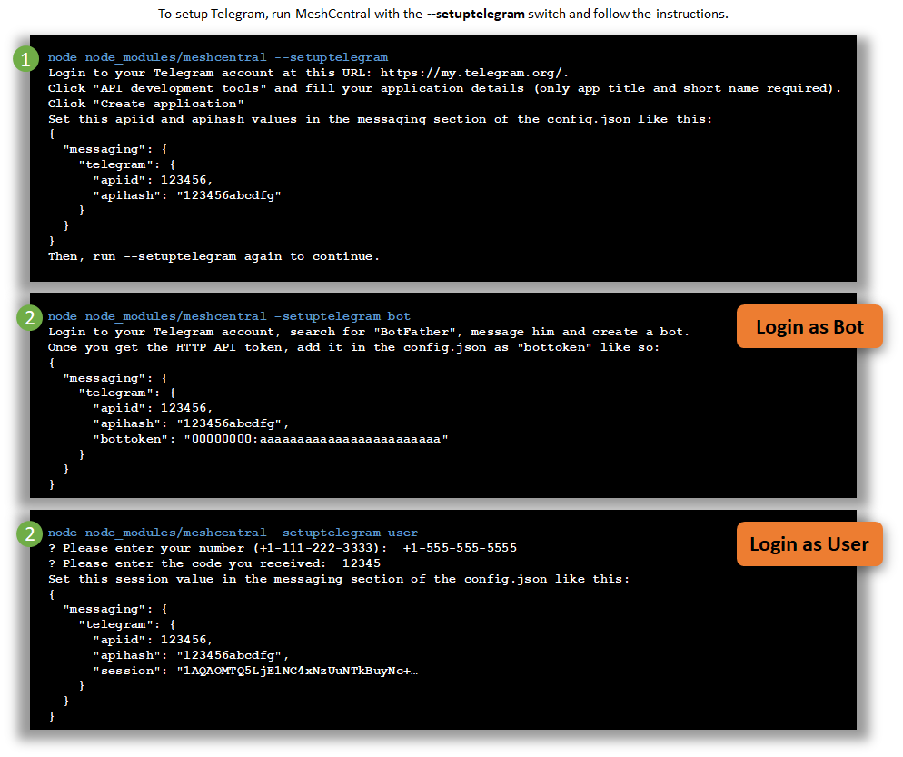
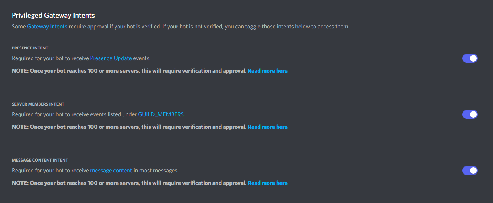
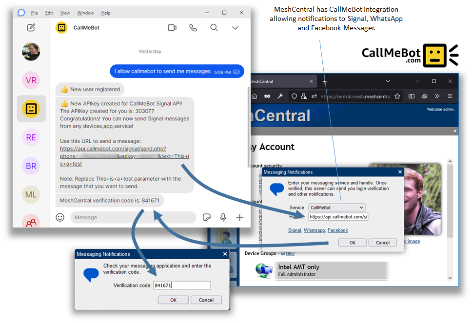
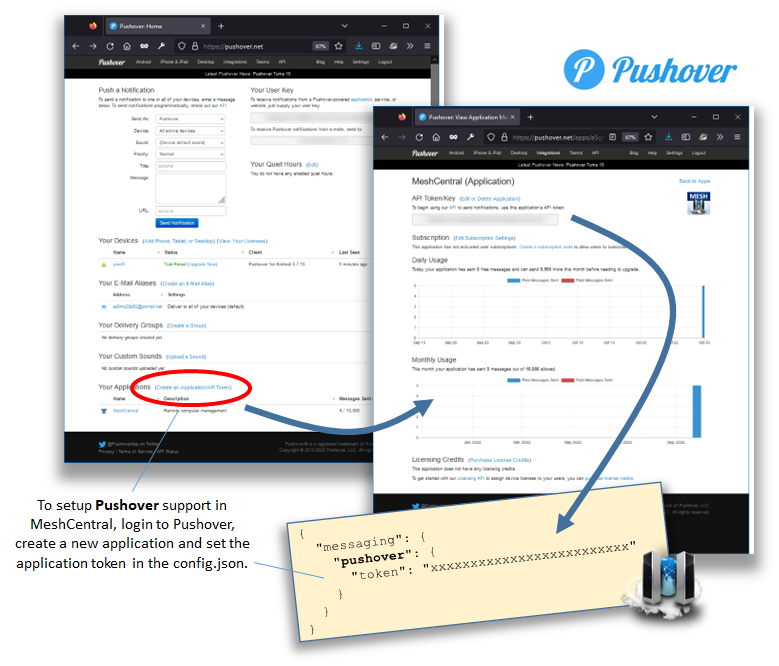
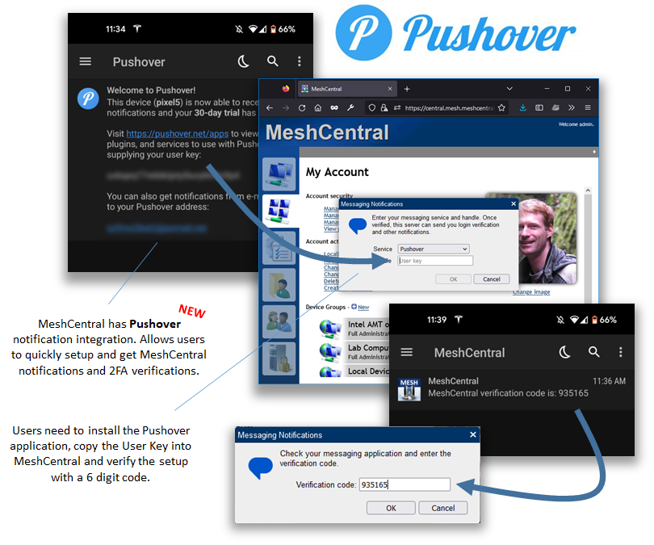
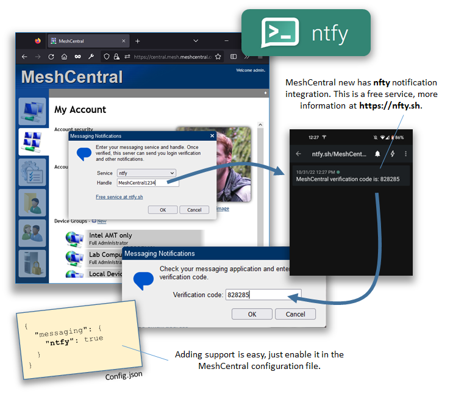
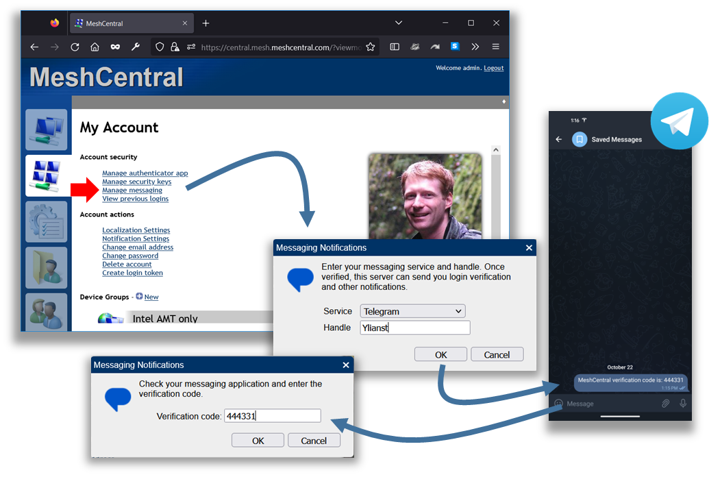
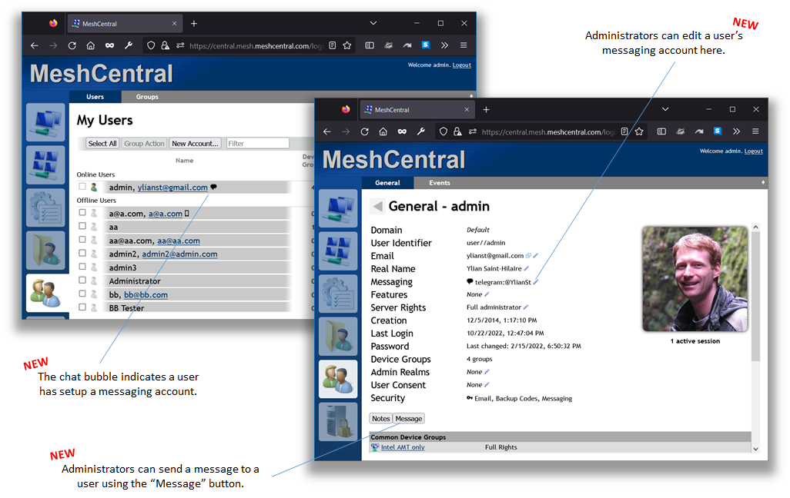
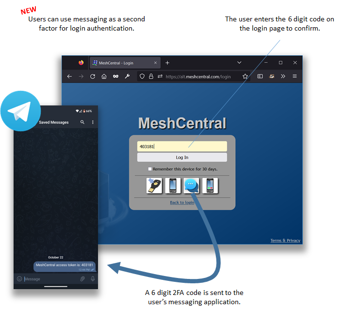
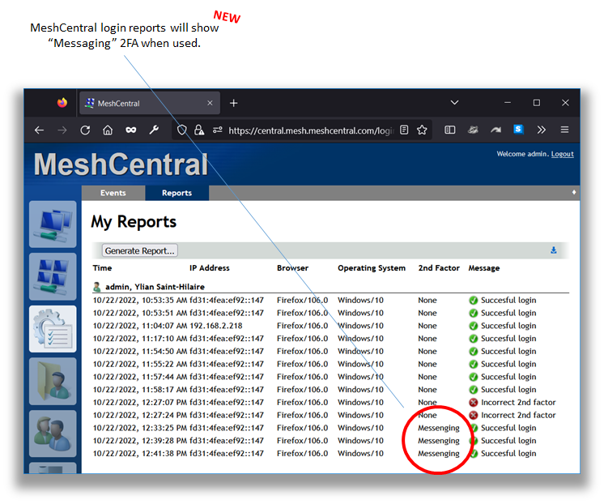

# Messaging

## Table of Contents

[Introduction](#introduction)  
[Telegram Setup](#telegram-setup)  
[Discord Setup](#discord-setup)  
[XMPP Setup](#xmpp-setup)  
[CallMeBot Setup](#callmebot-setup)  
[Pushover Setup](#pushover-setup)  
[ntfy Setup](#ntfy-setup)  
[Zulip Setup](#zulip-setup)  
[User Setup](#user-setup)  
[Administrator Management](#administrator-management)  
[Two-Factor Authentication](#two-factor-authentication)  

## Introduction

MeshCentral supports messaging platforms so that users can register a messaging account with MeshCentral and receive notifications. This is useful since messages are sent to an application the user is confirtable with and many messaging platforms have clients on mobile phones, desktop and more so that the notification can show up where the user is.

## Telegram Setup

For Telegram integration, you will need to provide MeshCentral with the necessary login information so that MeshCentral can authenticate and connect to the Telegram servers and start sending notifications. For Telegram, both user and bot login is supported with bot login being the more typical way to go. The configuration in the config.json for a bot login looks like this:

```json
{
  "settings": {
    "Cert": "devbox.mesh.meshcentral.com",
  },
  "domains": {
    "": {
      "title": "My Server"
    }
  },
  "messaging": {
    "telegram": {
      "apiid": 0,
      "apihash": "00000000000000000000000",
      "bottoken": "00000000:aaaaaaaaaaaaaaaaaaaaaaaa"
    }
  }
}
```

Note the "messaging" section in the config.json. For Telegram user login, it looks like this:

```json
{
  "messaging": {
    "telegram": {
      "apiid": 0,
      "apihash": "00000000000000000000000",
      "session": "aaaaaaaaaaaaaaaaaaaaaaa"
    }
  }
}
```

User login makes use of "session", while bot login uses "bottoken". One way to get started with the setup is to run `node node_modules/meshcentral --setuptelegram` and follow the instructions.



In the first step, you will get the apiid and apihash values. In the second step you get the bottoken or enter your phone number and code to get the session value. Once done, when running the server manually from the command line, the server should indicate that it can connect to Telegram like this:

```
MeshCentral HTTP redirection server running on port 80.
MeshCentral v1.0.87, Hybrid (LAN + WAN) mode.
MeshCentral Intel(R) AMT server running on central.mesh.meshcentral.com:4433.
MeshCentral HTTPS server running on central.mesh.meshcentral.com:443.
MeshCentral HTTPS relay server running on relay1.mesh.meshcentral.com:443.
MeshCentral Telegram client is bot connected.
```

Note the last line, indicating it's connected as a bot.

## Discord Setup

For Discord integration, you need to provide MeshCentral with a bot application token so that MeshCentral can login and send notifications to users. The Discord bot will need to be joined to one or more Discord servers and users will need to join at at least one Discord server that is in common with the bot to receive notifications.

There are many tutorials online on how to create a Discord bot and get the login token. For example follow the [two first sections of this tutorial](https://www.freecodecamp.org/news/create-a-discord-bot-with-javascript-nodejs/). The "How to Create a Discord Bot Account" section will show how to create a bot and get the token, the "How to Invite Your Bot to Join a Server" section shows how to join the bot to a Discord server.

Note that Privleged Gateway Intents permissions is needed for the bot on Discord. If not set, MeshCentral will show an error when trying to connect to Discord.



Discord integration requires that MeshCentral be run on NodeJS v17 or higher. Once you have the Discord bot login token, the config.json Discord configuration looks like this:

```json
{
  "messaging": {
    "discord": {
      "serverurl": "https://discord.gg/xxxxxxxxx",
      "token": "xxxxxxxxxxxxxxxxxxxxxxxxxxxx.xxxxxxxxxxxxxxxxxxxxxxxxxxxx"
    }
  }
}
```

Once users will need to join the same Discord server as the bot, the optional "serverurl" can be used to give the users a URL link to join the server, this can be a server invitation link or some other URL with instructions.

## XMPP Setup

For XMPP integration, you need to provide MeshCentral with a XMPP server, username and password so that MeshCentral can login and send notifications to users. You can get a XMPP account to any number of servers or start up your own XMPP server.

```json
{
  "messaging": {
    "xmpp": {
      "service": "xmppserver.com",
      "credentials": {
        "username": "username",
        "password": "password"
      }
    }
  }
}
```

An easy way to get setup with XMPP is to create a free account with [chatterboxtown.us](https://chatterboxtown.us/) and then, setup MeshCentral with the service value set to "chatterboxtown.us" along with the username and password of you account. This can be done in minutes. Once setup, users will be able to setup and verify XMLL accounts and use this for notifications and 2FA verification.

## CallMeBot Setup



[CallMeBot](https://www.callmebot.com/) is a free system that allows users to receive notifications on Signal Messenger, Whatsapp and Facebook Messenger. Enabling this feature is very simple, just enable it like this:

```json
{
  "messaging": {
    "callmebot": true
  }
}
```

Once enabled, users see the new "CallMeBot" option when trying to enable messaging in MeshCentral. They will need to follow specific instructions to enable CallMeBot to send notifications to their messaging application.

  - [Signal Messenger](https://www.callmebot.com/blog/free-api-signal-send-messages/)
  - [Whatsapp](https://www.callmebot.com/blog/free-api-whatsapp-messages/)
  - [Facebook Messenger](https://www.callmebot.com/blog/free-api-facebook-messenger/)

Once the user has enabled their account, they can cut & paste the CallMeBot URI into MeshCentral to validate their account.

## Pushover Setup

[Pushover](https://pushover.net/) is another notification service that makes it's own mobile application. To get started, download the Pushover application and create an account then go to the https://pushover.net/ web site and setup a new application like this:



You can setup an application with a name and icon, then, once you get a application token you can add it to the config.json like this:

```json
{
  "messaging": {
    "pushover": {
      "token": "xxxxxxxxxxxxxxxxxxxxx"
    }
  }
}
```

Once setup, the server will offer users the "Pushover" option when setting up messaging. Users will need to copy the Pushover user key into the dialog box to verify notifications are correct.



## ntfy setup

[ntfy](https://ntfy.sh/) is a completely free notification service. You can enable the ntfy integration with the following config.json section:

```json
{
  "messaging": {
    "ntfy": true
  }
}
```

No setup is reqired to enable this. When using ntfy, make sure you use a suffisently random topic name so that others can't guess the name and subscribe to it to receive your messages.



## Zulip setup

You can enable the MeshCentral [Zulip](https://zulip.com/) integration with the following config.json section:

```json
{
  "messaging": {
    "site": "https://api.zulip.com",
    "email": "your-bot@zulip.com",
    "api_key": "your_32_character_api_key"
  }
}
```

## User Setup

Once one or more messaging systems are setup with MeshCentral, users will be able to register their handle and verify that they own that account by typing in a 6 digit code.



This verification is necessary so that MeshCentral does not send notifications to incorrect messaging accounts.

## Administrator Management

When users setup a messaging account, a messaging bubble will show up next to their name in the "My Users" tab. You can also click on a user to see and edit it's messaging handle and message them. Currently MeshCentral can only send messages, no receive.



## Two-Factor Authentication

By default, messaging is used as a second factor for login when a user enabled a messaging account. Users will need to messaging icon on the login screen and can opt to receive a 6 digit code to login.



As an administrator you can turn off use of messaging for 2FA using the following settings in the config.json:

```json
{
  "settings": {
    "Cert": "devbox.mesh.meshcentral.com",
  },
  "domains": {
    "": {
      "title": "My Server",
      "passwordRequirements": {
        "msg2factor": false
      }
    }
  }
}
```

Notice the `msg2factor` is set to false. In this case, messaging can still be used for user notifications, but will not be offered as a 2FA option.

For administrators, login reports will show if "Messaging" was used as a second factor for a user login. You can see this in this report:

